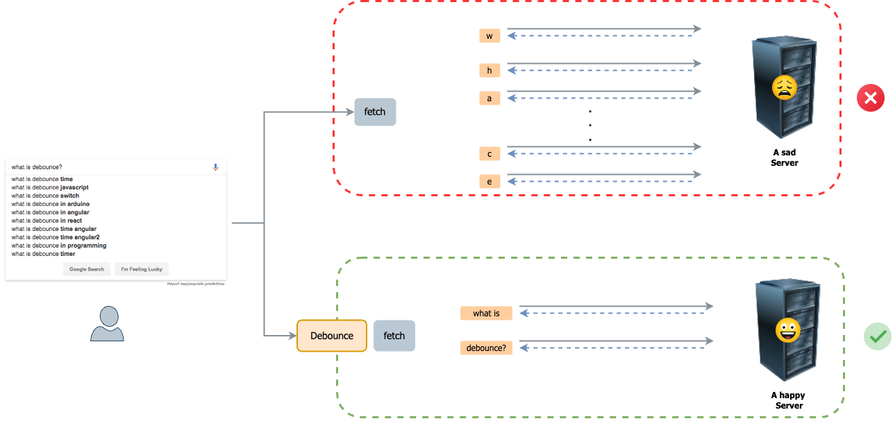

**Debounce** is a pattern to limit the rate at which a function can fire. Its also one of the most frequently asked JavaScript Interview questions, as it requires a deep understanding of JavaScript asynchronous programming and closer.

# But why do we want to limit the rate of server calls?

Consider the below situation.



## Key Points:
Google search is an interesting case of Debounce pattern. If you are designing this page, you may want to consider the following.

1. On every meaningful full keyword, we want to provide autocomplete suggestions to the user.
1. Providing suggestions too early, at every keypress, would be meaningless. Also, it will put an unnecessary load on the server.
1. Providing it early enough would defeat the purpose of autocomplete suggestions.


# Let's build Debounce
Now we know why we would need a Debounce until let's make one.

## Pattern Objectives
1. Delay the function call.
1. Limit the number of function calls.
1. Maintain the context (JavaScript thing 😇)

## Video Tutorial

<YoutubePlayer src="https://www.youtube.com/embed/s52C_72qr5M"  />


# Code

## Final Debounce

```js
function debounce(func, wait) {

    let setTimeoutRef;

    return function (...arg) {
        const context = this;

        clearTimeout(setTimeoutRef);
        setTimeoutRef = setTimeout(() => {
            func.apply(context, arg)
        }, wait);
    }
}
```


## Search Component used on Video Tutorial

```jsx
import React, { useState } from 'react';
import { useCallback } from 'react';


/**
 * Agenda:
 * [x] Delaying a function call
 * [x] Cancelling a function call, if a new call happens before the wait expired.
 * [x] Maintaining the Context.
 */

function debounce(func, wait) {

    let setTimeoutRef;

    return function (...arg) {
        const context = this;

        clearTimeout(setTimeoutRef);
        setTimeoutRef = setTimeout(() => {
            func.apply(context, arg)
        }, wait);
    }
}

function Search() {

    const [text, setText] = useState();
    const [smartText, setSmartText] = useState();

    const debouncedSmartText = useCallback(debounce(setSmartText, 2000), []);

    const handleChange = (event) => {
        const value = event.target.value;
        setText(value);
        debouncedSmartText(value);
    }

    return (
        <div>
            <h1>Debounce Search</h1>

            <input type="text" placeholder='Search...' onChange={handleChange} />
            <h2>Simple Text:</h2>
            <output>
                {text}
            </output>

            <h2>Smart Text:</h2>
            <output>
                {smartText}
            </output>
        </div>
    );
}

export default Search;

```

## Search Class Component used on Video Tutorial

```jsx
import React from 'react';


/**
 * Agenda:
 * [x] Delaying a function call
 * [x] Cancelling a function call, if a new call happens before the wait.
 * [x] Maintaining the Context.
 */

function debounce(func, wait) {

    let setTimeoutRef;

    return function (...arg) {
        const context = this;

        clearTimeout(setTimeoutRef);
        setTimeoutRef = setTimeout(() => {
            func.apply(context, arg)
        }, wait);
    }
}

class SearchByClass extends React.Component {

    constructor(props) {
        super(props);

        this.state = {}
        this.handleChange = this.handleChange.bind(this);
        this.debouncedHandleSmartText = debounce(this.handleSmartText, 2000);
    }

    handleChange(event) {
        const value = event.target.value;
        this.handleText(value);
        this.debouncedHandleSmartText(value);
    }

    handleText(text) {
        this.setState({
            text
        })
    }


    handleSmartText(text) {
        console.log('this >> ', this);
        this.setState({
            smartText: text
        })
    }

    render() {

        const { text, smartText } = this.state;
        return (
            <div>
                <h1>Debounce Search By Class</h1>

                <input type="text" placeholder='Search...' onChange={this.handleChange} />
                <h2>Simple Text:</h2>
                <output>
                    {text}
                </output>

                <h2>Smart Text:</h2>
                <output>
                    {smartText}
                </output>
            </div>
        );
    }
}

export default SearchByClass;
```


# Summary
Thanks a lot for reading this article. If you liked it or have any suggestions on feedback, please drop a comment on [YouTube Video of this article.](https://www.youtube.com/s52C_72qr5M)