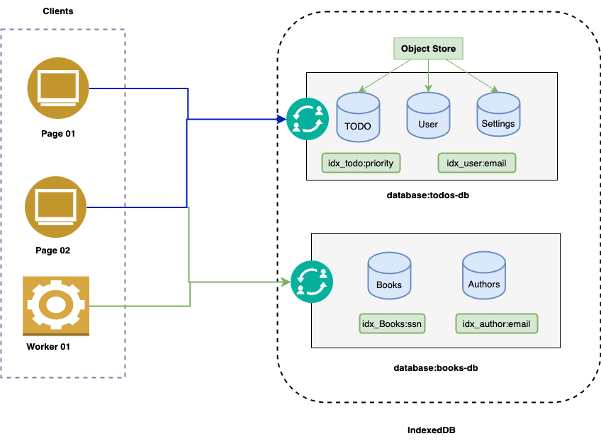
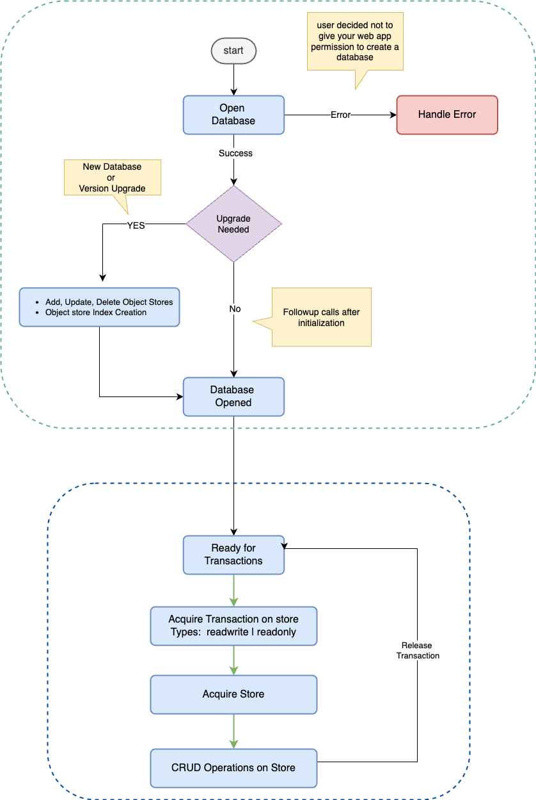
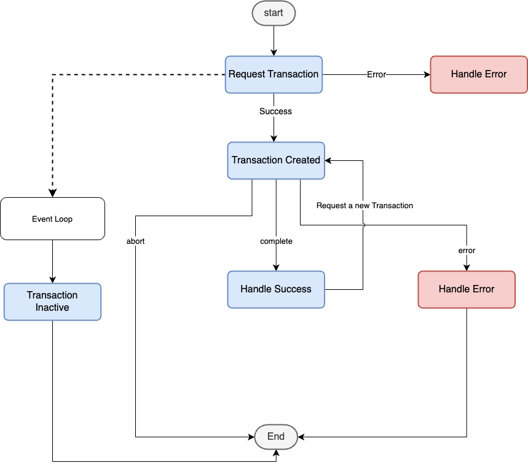
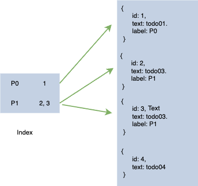

# What is IndexedDB?

IndexedDB is a low-level API for client-side storage of significant amounts of structured data, including files/blobs.
This API uses indexes to enable high-performance searches of this data.
While Web Storage is useful for storing smaller amounts of data, it is less useful for storing larger amounts of structured data. IndexedDB provides a solution.

# key characteristics of IndexedDB

-   **IndexedDB databases store key-value pairs:** The values can be complex structured objects, and keys can be properties of those objects.
-   **IndexedDB is built on a transactional database model:** Everything you do in IndexedDB always happens in the context of a transaction.
-   **Asynchronous APIs:** The IndexedDB API is mostly asynchronous or event-based.
-   **Built on a transactional database model:** IndexedDB is built on a transactional database model. Everything you do in IndexedDB always happens in the context of a transaction.
-   **Dom Events:** IndexedDB uses DOM events to notify you when results are available. DOM events always have a type property
-   **Object Oriented, Not Relational:** IndexedDB is object-oriented. IndexedDB is not a relational database with tables representing collections of rows and columns. This fundamental difference affects the way you design and build your applications.
-   **High Capacity:** In GBs, much more than local or session storage

# Master Class on YouTube

<YoutubePlayer src="https://www.youtube.com/embed/SoGNd6ShtEE" />

## Code used in Master Class

1. **Start**: [https://github.com/ipraveen/indexeddb-todo/tree/start](https://github.com/ipraveen/indexeddb-todo/tree/start)
1. **Native**: [https://github.com/ipraveen/indexeddb-todo/tree/db-native](https://github.com/ipraveen/indexeddb-todo/tree/db-native)
1. **Final**: [https://github.com/ipraveen/indexeddb-todo/tree/db-idb](https://github.com/ipraveen/indexeddb-todo/tree/db-idb)

# Architecure

## Key Terms

1. **Database:** The highest level of IndexedDB. It contains the object stores, which in turn contain the data you would like to persist. You can create multiple databases with whatever names you choose.
1. **Object Store:** An individual bucket to store data. You can think of object stores as being similar to tables in traditional relational databases
1. **Transaction:** A group of operations, that ensures database integrity. All read or write operations in IndexedDB must be part of a transaction. This allows for atomic read-modify-write operations without having to worry about other threads acting on the database at the same time.
1. **Index:** A kind of object store for organizing data in another object store. You can use it for faster retrieval of data. It can be unique or may not be.
1. **Cursor:** A mechanism for iterating over multiple records in a database.

# IndexedDB Lifecycle

## Key Points
1. Open a database. Handle error or success.
1. Create an Object Store in the database. Assign optional Indexes to it.
1. Start a transaction for CRUD operations.
1. Assign callbacks to events(DOM) and handle data.
1. Start again!

# IndexedDB Transaction Model

Everything you do in IndexedDB always happens in the context of a transaction.
The IndexedDB API provides lots of objects that represent indexes, tables, cursors, and so on, but each of these is tied to a particular transaction. Thus, you cannot execute commands or open cursors outside of a transaction. Transactions have a well-defined lifetime, so attempting to use a transaction after it has been completed throws exceptions.
Also, transactions auto-commit and cannot be committed manually.

# Indexe & Cursor

# Summary

Thanks a lot for reading this article. If you liked it, or have any suggestions on feedback, please drop a comment on [YouTube Video of this article.](https://youtu.be/SoGNd6ShtEE)
