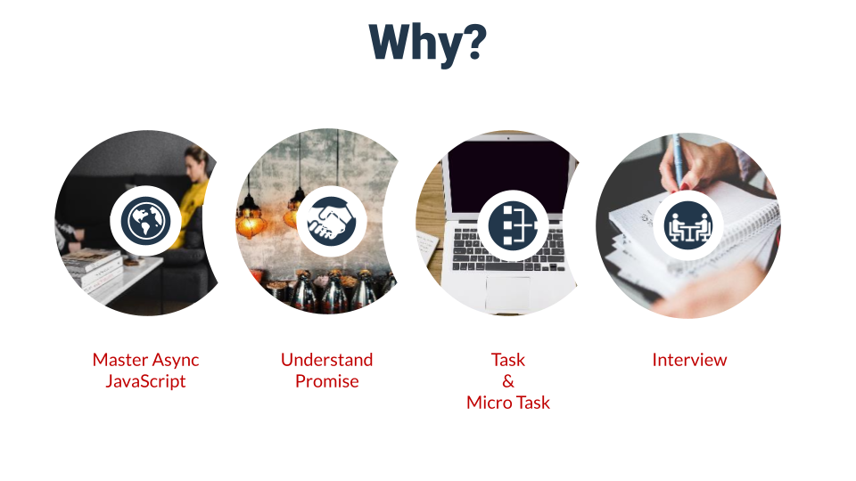

JavaScript Promise simplified the way we write asynchronous JavaScript code. It helps you to avoid *callback-hell*.
But much before it was officially introduced in JavaScript in ES6, we have other libraries which offer Promise like behavior, perfectly working in old Browsers. it's because Promise never needed any new language support. You can write JavaScript Promise in plain JavaScript. And we going to attempt that today.


# Ahh...why do we want to do this?



# Promise Lifecycle


# Video Tutorial
I've step by step guide to writing a custom Javascript Promise

<YoutubePlayer src="https://www.youtube.com/embed/RL_IQuC3CrE" title="YouTube video player" />

# Code used in Video

## MyPromise.js

```js

// ECMA 262

const STATE = {
    PENDING: 'PENDING',
    FULFILLED: 'FULFILLED',
    FAILURE: 'FAILURE',
};

// Utils

const isFunction = (func) => typeof func === 'function';

function MyPromise(callback) {
    let state = STATE.PENDING;
    const thenCallbacks = [];
    const catchCallbacks = [];

    const executeCallbacks = (val) => {
        if (isFunction(val?.then)) {
            val.then(resolve, reject);
            return;
        }

        const callbacks = state === STATE.FULFILLED ? thenCallbacks : catchCallbacks;

        callbacks.forEach((callback) => {
            queueMicrotask(() => callback(val));
        });
    };

    const resolve = (val) => {
        state = STATE.FULFILLED;
        try {
            executeCallbacks(val);
        } catch (error) {
            reject(val);
        }
    };

    const reject = (val) => {
        state = STATE.FAILURE;
        executeCallbacks(val);
    };

    callback(resolve, reject);

    return {
        then(thenCallback, catchCallback) {
            return new MyPromise((nextResolve, nextReject) => {
                // Then
                thenCallbacks.push((result) => {
                    if (isFunction(thenCallback)) {
                        nextResolve(thenCallback(result));
                    } else {
                        nextResolve(result);
                    }
                });

                // Catch
                catchCallbacks.push((result) => {
                    if (isFunction(catchCallback)) {
                        nextReject(catchCallback(result));
                    } else {
                        nextReject(result);
                    }
                });
            });
        },
        catch(callback) {
            return this.then(null, callback);
        },
        finally(callback) {
            return this.then(
                (result) => {
                    callback();
                    return result;
                },
                (error) => {
                    callback();
                    return error;
                }
            );
        },
    };
}

module.exports = MyPromise;
```

## test.js

Comment and Uncomment the test cases as per the need.

```js
const MyPromise = require('./MyPromise');

// Simple Promise Testing
{
    const promise = new MyPromise((resolve, reject) => {
        setTimeout(() => {
            // resolve('Simple promise');

            reject('Oops... error in simple promise');
        }, 500);
    });

    promise.then((val) => console.log(val));
    promise.then((val) => console.log(val));
    promise.then((val) => console.log(val));
    promise.catch((val) => console.log(val));
}

// Promise Chain Testing
{
    const promise = new MyPromise((resolve, reject) => {
        setTimeout(() => {
            // resolve('Chain promise');
            reject('Chain: Oops... error in simple promise');
        }, 1000);
    });

    promise
        .then((val) => { // promise2
            console.log('Chain T1: ' + val);
            return 'Via T1 => ' + val;
        })
        .then((val) => { // promise3
            console.log('T2: ', val);
            return val;
        })
        .catch((val) => console.log(val));
}

// Promise Chain Testing
{
    const promise = new MyPromise((resolve, reject) => {
        setTimeout(() => {
            resolve('Chain promise');
            // reject('Chain: Oops... error in simple promise');
        }, 1000);
    });

    promise
        .then((val) => {
            // promise2
            console.log('Simple: ' + val);
            return val;
        })
        .then((val) => {
            console.log('T2: ' + val);
            return new MyPromise((resolve, reject) => {
                setTimeout(() => {
                    resolve('From P1');
                }, 2000);
            });
        })
        .then((val) => {
            console.log('T3: ', val);
        })
        .catch((val) => console.log(val));
}

// Finally Chain Testing
{
    const promise = new MyPromise((resolve, reject) => {
        setTimeout(() => {
            // resolve('Promise');
            reject('Chain: Oops... error in simple promise');
        }, 1000);
    });

    promise
        .then((val) => {
            console.log('T1: ', val);
            return val;
        })
        .then((val) => {
            console.log('T2: ', val);
            return val;
        })
        .finally(() => {
            console.log('F1');
        })
        .then((val) => {
            console.log('T3: ', val);
        })
        .catch((val) => console.log(val))
        .finally(() => {
            console.log('Final Finally');
        });
}
```


# Summary
Thanks a lot for reading this article. If you liked it, or have any suggestions on feedback, please drop a comment on [YouTube Video of this article.](https://youtu.be/RL_IQuC3CrE)