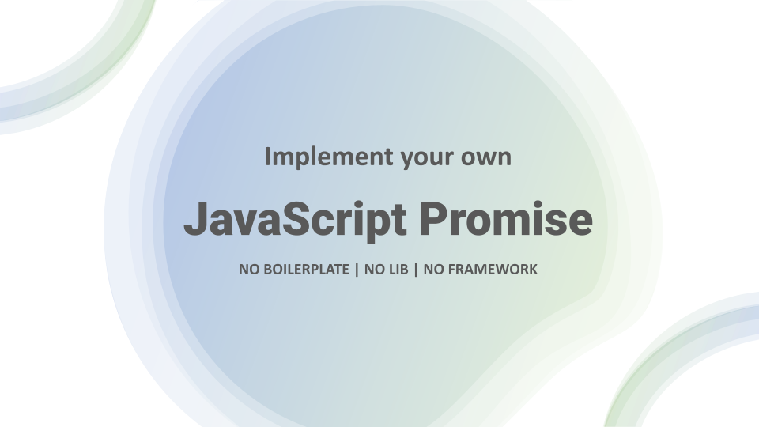

JavaScript Promise simplified the way we write asynchronous JavaScript code. It helps you to avoid *callback-hell*.
But much before it was officially introduced in JavaScript in ES6, we have other libraries which offer Promise like behavior, perfectly working in old Browsers. it's because Promise never needed any new language support. You can write JavaScript Promise in plain JavaScript. And we going to attempt that today.


# Ahh...why do we want to do this?


# Video Tutorial
I've step by step guide to writing a custom Javascript Promise

<YoutubePlayer src="https://www.youtube.com/embed/RL_IQuC3CrE" title="YouTube video player" />

# Code - Step By Step
We will going to build the code step by step next, but we will do it slowly with clear Objective of each part.


## Implement a simple then handler

**Objective**

```js


```


# Summary
Thanks a lot for reading this article. If you liked it, or have any suggestion on feedback, please drop a comment on [YouTube Video of this article.](https://youtu.be/RL_IQuC3CrE)