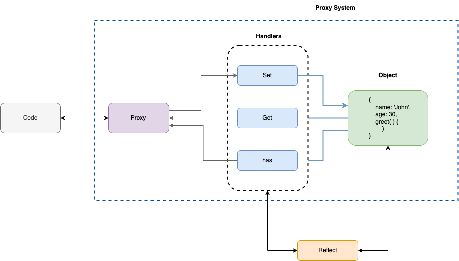

# What is a JavaScript Proxy?
The Proxy object allows you to create an object that can be used in place of the original object, but which may redefine fundamental Object operations like getting, setting, and defining properties.

A few use cases are:

1. **Intercept property access:** Intercept a field, log things, put analytics.
1. **Validation:** You can validate each field before its value is set, throw errors if required.
1. **Format:** You can format a field before its value is set.
1. **Infer:** You can infer the value for a field from another field.


# Overview



# Tutorial on YouTube

<YoutubePlayer src="https://www.youtube.com/embed/2QZnJCyEOBw" />

# Code Examples

## Basic Syntax

```js
const proxy = new Proxy(target, handlers);

```

## Proxy without Handlers

```js
const user = {
    name: 'John',
    age: 30,
};

const proxy = new Proxy(user, {});

proxy.name = 'Mark'; // This will update the original user Object 

console.log('Name: ', proxy.name);
console.log('Age: ', proxy.age);

```

**Output:**

```sh
Name:  Mark
Age:  30
```

# Get Handler

## Use cases
1. Retrieve a field value.
1. Restrict access of a field value

## Retrieve a value with log


```js
const user = {
    name: 'John',
    age: 30,
};

const proxy = new Proxy(user, {
    get(target, prop) {
        console.log('Fetching from Proxy'); // Check this on console.
        return target[prop];
    },
});

proxy.name = 'Mark';

console.log('Name: ', proxy.name);
console.log('Age: ', proxy.age);

```

## Access Restriction


```js
  const user = {
        name: 'John',
        age: 30,
    };

    const proxy = new Proxy(user, {
        get(target, prop) {
            if (prop === 'age') {
                console.error('[age] This field is not accessible publicly.');
                return 'NULL';
            }
            return target[prop];
        },
    });

    proxy.name = 'Mark';

    console.log('Name: ', proxy.name);
    console.log('Age: ', proxy.age);
```

Error:

```sh
Name:  Mark
[age] This field is not accessible publicly.
Age:  NULL
```

# Set Handler
## Use cases
1. Correct, Format, and Infer a value before setting
1. Validation

## Age Validation

```js

   const user = {
        name: 'John',
        age: 30,
    };

    const proxy = new Proxy(user, {
        set(target, prop, value) {
            if (prop === 'age') {
                if (!Number.isInteger(value)) {
                    throw new TypeError('The age is not an integer');
                }
                if (value > 150 || value < 0) {
                    throw new RangeError('The age seems invalid');
                }
            }
            target[prop] = value;
        },
    });

    // SUCCESS
    proxy.age = 50;

    // ERRORS
    proxy.age = 200;    // Uncaught RangeError: The age seems invalid
    proxy.age = -1;     // Uncaught RangeError: The age seems invalid
    proxy.age = '30';   // Uncaught TypeError: The age is not an integer


```

## Infer another field

```js

     const user = {
        name: 'John',
        age: 30,
    };

    const proxy = new Proxy(user, {
        set(target, prop, value) {
            if (prop === 'age') {
                target['isAdult'] = value >= 18;
            }
            target[prop] = value;
        },
    });

    // Yes
    proxy.age = 30;
    console.log(proxy);

    // No
    proxy.age = 16;
    console.log(proxy);

```
**Output**

```sh
Proxy(Object) {name: 'John', isAdult: true, age: 30}
Proxy(Object) {name: 'John', isAdult: false, age: 16}
```


# JavaScript Reflect
Proxy and Reflect were both introduced in ES6 and are used for performing tasks, but they are a bit different.

Reflect is an inbuilt object that simplifies the creation of Proxy and makes it possible to call internal methods.

## Simplify Proxy code with Reflect

```js
    const user = {};

    const proxy = new Proxy(user, {
        get(target, prop) {
            return Reflect.get(...arguments);
        },
        set(target, prop, value) {
            if (prop === 'age') {
                Reflect.set(target, 'isAdult', value >= 18);
            }
            return Reflect.set(...arguments);
        },
    });

    proxy.name = 'John';
    proxy.age = 30;
    console.log(proxy);

    proxy.age = 16;
    console.log(proxy);

```

**Output**

```sh
Proxy(Object) {name: 'John', isAdult: true, age: 30}
Proxy(Object) {name: 'John', isAdult: false, age: 16}
```

# Custom Solution: Build an Observer

## Use Case
1. We want to log the access of greet
1. call logger.greetWillCall before greet and pass the arguments.
1. call logger.greetDidCall after greet and pass the arguments.


## Solution

```js
    const logger = {
        greetWillCall(args) {
            console.log('Greet will be called with arguments: ', args);
        },

        greetDidCall(args) {
            console.log('Greet Did be called with arguments: ', args);
        },
    };

    const user = {
        name: 'John',
        age: 30,
        greet(greetWith) {
            console.log(`${greetWith} ${this.name}`);
        },
    };

    const proxy = new Proxy(user, {
        get(target, prop, reciver) {
            switch (prop) {
                case 'greet':
                    return function (...arg) {
                        logger.greetWillCall(arg);
                        const returnVa = target[prop].apply(target, arguments);
                        logger.greetDidCall(arg);
                        return returnVa;
                    };
                default:
                    return Reflect.get(...arguments);
            }
        },
    });

    // Greet
    proxy.greet('Hi!');

    ```

**Output**


```sh
Greet will be called with arguments:  ['Hi!']
Hi! John
Greet Did be called with arguments:  ['Hi!']
```

# Summary

Thanks a lot for reading this article. If you liked it, or have any suggestions on feedback, please drop a comment on [YouTube Video of this article.](https://youtu.be/2QZnJCyEOBw)
