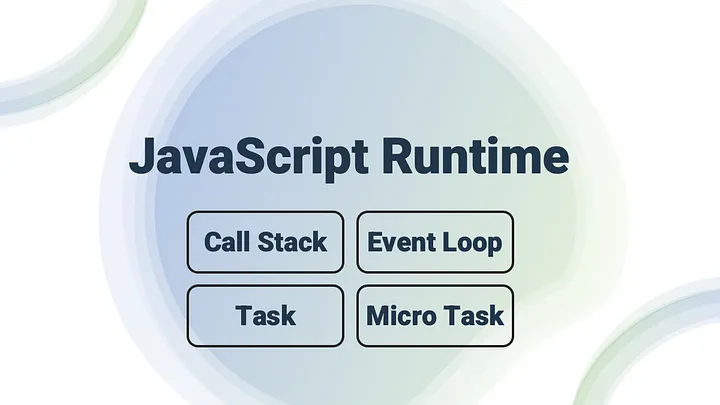

It’s hard to imagine that JavaScript does all multi-tasking while being a single-threaded programming language. 🤔 Let’s demystify the following: How does JavaScript Runtime perform that? What is the role of Event Loop, Task, Micro Task, and Call Stack in JavaScript Runtime?




# Video Tutorial
<YoutubePlayer src="https://www.youtube.com/embed/8JBky6p2RNc" title="YouTube video player" />


# Code snnipets in Video

## Starting Problem

```js
console.log('Start');

const foo = () => {
    Promise.resolve('Promise')
        .then((msg) => console.log(msg));
};

const bar = () => {
    setTimeout(() => console.log('Timer'), 0);
    return foo();
};

bar();
console.log('End');

```

## Stack Explanation

```js
console.log('Start');

const foo = () => {
    console.log('foo');
};

const bar = () => {
    console.log('bar');
    return foo();
};

bar();
console.log('End');
```

### Final Problem

```js
console.log('Start');

const foo = () => {
    Promise.resolve('Microtask in Queue')
        .then((msg) => console.log(msg));
};

const bar = () => {
    setTimeout(() => console.log('Timeout in bar'), 100);
    return foo();
};

bar();
console.log('End');
```