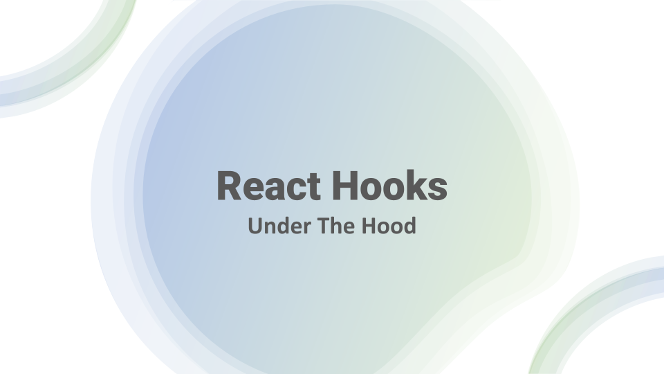
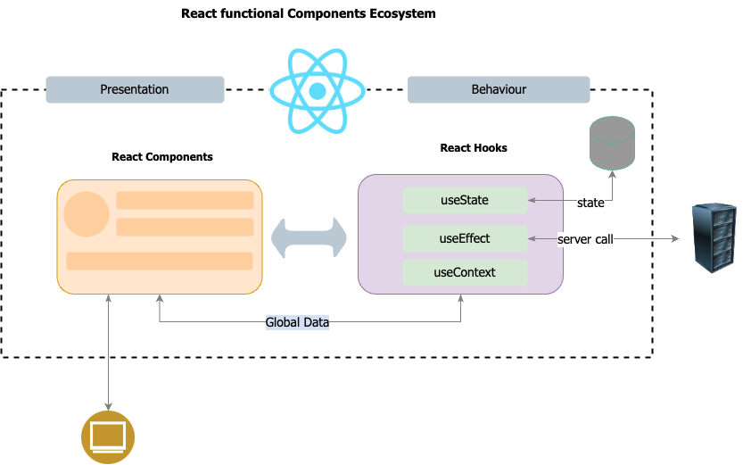
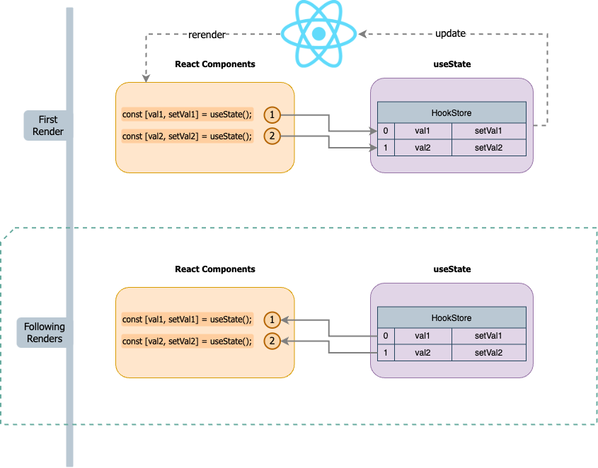

I love React hooks!

It provides a much simpler solution to a much more complex problem. It makes your React components cleaner, easy to understand, and scale.
However, sometimes, even to experienced frontend engineers, working on hooks is nothing less than Magic. 

This article is all about breaking that Magic and explaining how React Hooks work - Under the hood!

# What are React Hooks?
Let's understand React Hooks one more time.

Hooks let you use different React features from your components. It can also allow you to maintain state, do side effects, make server calls, interact with DOM, etc.



## Rules of React Hooks
React Hook's power is in its simplicity. And to have that simplicity, you must strictly adhere to a few rules.

- **Don’t call Hooks inside loops, conditions, or nested functions:** Only call Hooks at the top level.
- **Only Call Hooks from React Functions:** React function components or a Custom React Hook.

The simple-looking first rule is the core of the simplicity of React Hooks and also behind its Magic.
It will be more clear as you progress to this article. 😀

# Video Tutorial
A step-by-step guide
<YoutubePlayer src="https://www.youtube.com/embed/N9cFPtkqtWI"  />

# React Rendering with React Hooks




# Code used in Video

**src/Counter.jsx**

```jsx
import { useMyState } from './hooks';

function Counter() {
    const [count, setCount] = useMyState(0);
    const [isEven, setEven] = useMyState(true);

    const handleClick = () => {
        const newCount = count + 1;
        setCount(newCount);
        setEven(newCount % 2 === 0);
    };

    return (
        <div>
            <h1>{count}</h1>
            <h2>Is Even: {isEven ? 'Yes' : 'No'}</h2>
            <button onClick={handleClick}>Click to +1 </button>
        </div>
    );
}

export default Counter;

```

**src/hooks.js**

```js

let hooksIdx = 0;
const store = [];

function setterFactory(idx) {
    return function setter(val) {
        store[idx].value = val;
    };
}

export function resetHookIndex() {
    hooksIdx = 0;
}

function useMyState(val) {
    // First Render Case
    if (store[hooksIdx] === undefined) {
        store.push({
            value: val,
            setter: setterFactory(hooksIdx),
        });
    }

    // Following cases

    const value = store[hooksIdx].value;
    const setter = store[hooksIdx].setter;

    // For next Run
    hooksIdx += 1;

    return [value, setter];
}

export { useMyState };


```

**src/index.js**
```js
import React from 'react';
import ReactDOM from 'react-dom/client';
import Counter from './Counter';
import { resetHookIndex } from './hooks';

const root = ReactDOM.createRoot(document.getElementById('root'));

setInterval(() => {
    resetHookIndex();
    root.render(<Counter />);
}, 500);

````


# Summary
Thanks a lot for reading this article. If you liked it or have any suggestions on feedback, please drop a comment on [YouTube Video of this article.](https://www.youtube.com/embed/N9cFPtkqtWI)